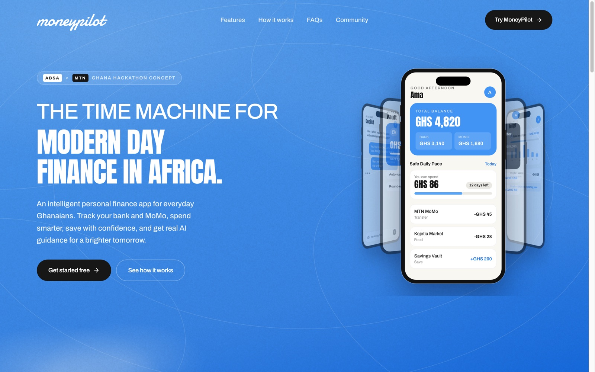
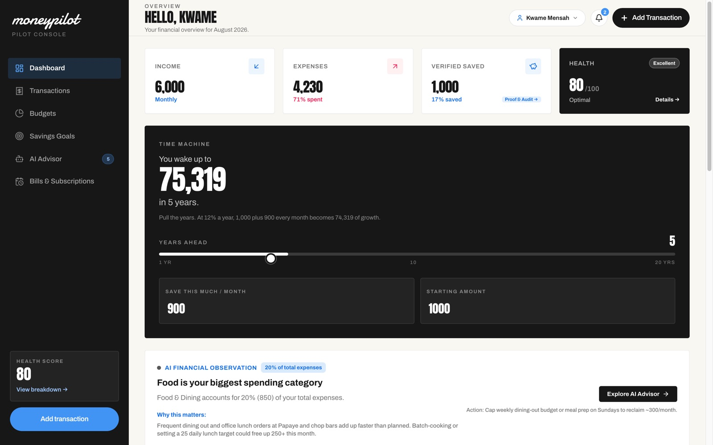

# MoneyPilot

AI-powered personal finance for everyday Ghanaians. Track bank and MoMo together, budget with a safe daily pace, save in vaults, and get practical Gemini-backed guidance.





## Features

- Unified bank, MoMo, and cash tracking
- Safe daily spend, budgets, goals, and debts
- Savings vaults and recurring bills
- Gemini AI copilot for affordability and next steps
- Editorial landing page with an autoplay product carousel

## Prerequisites

- Node.js 18+
- A Gemini API key

## Getting started

```bash
npm install
cp .env.example .env.local
```

Set `GEMINI_API_KEY` in `.env.local`, then:

```bash
npm run dev
```

The app serves the landing page first. Use **Try MoneyPilot** to open the console.

## Usage

| Command | What it does |
| --- | --- |
| `npm run dev` | Run the Express + Vite app locally |
| `npm run build` | Production client + server build |
| `npm start` | Serve the production build |
| `npm run lint` | Typecheck with `tsc --noEmit` |

Optional env:

| Variable | Purpose |
| --- | --- |
| `GEMINI_API_KEY` | Gemini API calls |
| `APP_URL` | Public app URL (OAuth, self-links) |

## Project layout

```text
public/assets/     required assets (images + architecture guide)
src/components/    app screens
src/components/ui/ landing and shared UI
src/App.tsx        landing page + finance console
server.ts          Express host and Gemini routes
```

Hero screens rotate on their own. There are no carousel click, pause, or hover controls.

## Assets

Keep every required asset in `public/assets/`. There is no `design/` folder.

| File | Used for |
| --- | --- |
| `screenshot-landing.jpg` | README landing preview |
| `screenshot-app.jpg` | README dashboard preview |
| `all_accounts_card.png` | Track Bank & MoMo feature |
| `smarter_spending_happier_living.png` | Safe Daily Pace feature |
| `savings_vault_card.png` | Savings vaults feature |
| `build_brighter_tomorrows.png` | AI advisor feature |
| `from_momo_to_more.png` | Campaign still |
| `subtle-paper-grain.png` | Hero paper texture |
| `MoneyPilot_Product_Architecture_Guide.md` | Product architecture notes |

Reference images as `/assets/<filename>`.

